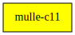

# mulle-c11

#### 🔀 Cross-platform C compiler glue

This project provides a C header that enables more feature-rich compilation
across various compilers and platforms. It also contains the basic
documentation for mulle-c development. **mulle-c11** is used by all
*mulle-c* or *mulle-objc* projects.

<!-- 
* [STEAL.md](dox/STEAL.md) on how to steal mulle-c source code and incorporate
it in your own projects. In effect somewhat like single-header convenience
with multiple files.
-->

* [SYNTAX.md](dox/SYNTAX.md) explains the naming scheme used in mulle-c data structure


| Release Version
|-----------------------------------
|  [](//github.com/mulle-c/mulle-c11/actions)


## Glue example

For example `MULLE_C11_CONSTRUCTOR( f) void  f( void);` will expand
differently, depending on the compiler and operating system:

### clang/gcc

```
__attribute__((constructor)) void  f( void);
```

### MicroSoft Windows

```
static void f(void);
  __declspec(allocate(".CRT$XCU")) void (*f_)(void) = f;
  __pragma(comment(linker,"/include:" p "f_"))
```


### You are here




## Add

Use [mulle-sde](//github.com/mulle-sde) to add mulle-c11 to your project:

```
mulle-sde dependency add --c --github mulle-c mulle-c11
```


## Install

Install the prerequisites first:

| Prerequisites                                 |
|-----------------------------------------------|
| [cmake](//cmake.org)                            |


Install into /usr/local:

```
mkdir build 2> /dev/null
(
   cd build ;
   cmake -DCMAKE_INSTALL_PREFIX=/usr/local \
         -DCMAKE_PREFIX_PATH=/usr/local \
         -DCMAKE_BUILD_TYPE=Release .. ;
   make install
)
```


### Platforms and Compilers

* clang based compilers
* gcc based compilers
* probably any other C11 compiler

* FreeBSD
* Linux
* MacOS
* Windows (MinGW)


## Author

[Nat!](//www.mulle-kybernetik.com/weblog) for
[Mulle kybernetiK](//www.mulle-kybernetik.com) and
[Codeon GmbH](//www.codeon.de)
